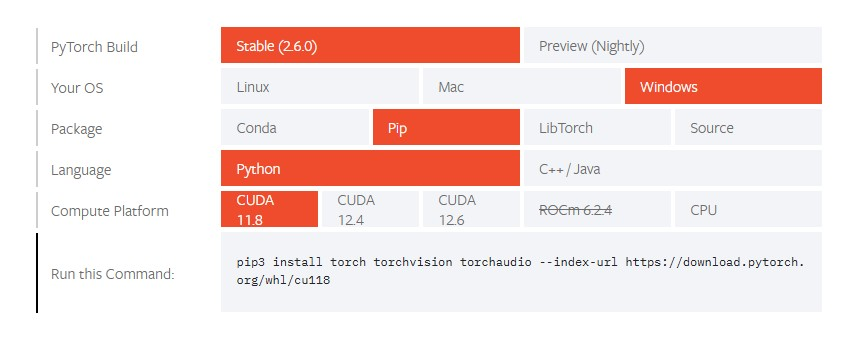

# SmartCV-Tokon

https://github.com/user-attachments/assets/f1c46930-3639-43b1-b6b0-a7d512f58d5a

SmartCV-Tokon is a tool designed to provide data on MARVEL Tōkon: Fighting Souls without the need for installing mods on your game, or the need for a powerful PC to read game data in real time. 

It's a project that uses pixel detection to recognize certain situations in the game to take the opportunity to read data from using OCR. Due to this, it's able to gather enough data to report the results on a match (some assumptions given). Look for the **How does it work?** section to get a more in-depth explanation.

## Requirements
- [OBS (optional if streaming)](https://obsproject.com/download)
- [Advanced Scene Switcher OBS Plugin (optional if streaming)](https://github.com/WarmUpTill/SceneSwitcher/releases)
- Your copy of MARVEL Tōkon: Fighting Souls must be in **English**. Support for other languages is being looked into.
- You must disable all mods that change the UI or in-game text in any way.

## Step 1: Installation
- Follow either one of the two steps below:
### Step 1.1: Installing the CPU version
- Installing the CPU version is very easy. Just download the compiled release.zip [here](https://github.com/skpeter/SmartCV-Tokon/releases).
- You can skip to step 2 from here.
### Step 1.2: Installing the GPU version
- Download **source.zip** from the [latest release](https://github.com/skpeter/SmartCV-Tokon/releases/latest/download/source.zip). Do not use GitHub's auto-generated "Source code" zip — it is missing the `core` files.
- Install Python if you haven't done so already [here](https://www.python.org/downloads/). **Recommended version is 3.12**.
- Open a command prompt terminal on the installed directory and type `pip install -r core/requirements.txt`
- You will need to then install PyTorch, which is done through command prompt/terminal. Go to Pytorch's "Start Locally" section [here](https://pytorch.org/get-started/locally/), pick the **Stable** build, select the OS you use (**Windows, Mac or Linux**), **Pip** as packaging system, **Python** as language and then select the **Compute Platform** available on your GPU. You can check which version of CUDA your GPU supports [here](https://en.wikipedia.org/wiki/CUDA#GPUs_supported).

- - Choosing these options will generate a command that you should copy and paste on your terminal/command prompt. PyTorch weighs around 3GB, so take your time.

## Step 2: Setup
- Follow either one of the two steps below:
### Step 1.1: Game Setup
If you are running the game on the same device you are running SmartCV, you pretty much do not need to do anything else. Just open the game alongside SmartCV and it should detect the game's window by itself.
### Step 2.2: OBS Setup 
SmartCV reads game data directly from the OBS video source you put it on through OBS Websockets. **Make sure you have OBS Websocket enabled and configured before continuing**. Open your `config.ini` file, find a setting called `source_title`, insert the name of your OBS source, and that's it! Make sure the other OBS settings are correct so SmartCV can connect with OBS. `width` and `height` are the resolution of the image OBS sends. If you want to save up on some CPU usage, you can lower this resolution (as long as it's 16:9 aspect ration), however some things may not behave like normal if you do.

## Step 3: Usage
- To run the GPU/source version, open a launch script: `smartcv.bat` (Windows), `smartcv.sh` (Linux), `smartcv.command` (macOS). Git clone: same files live under `core/`. CPU/release: `smartcv.exe`.
**From here all you need to do is follow the on-screen instructions for the game detection to start.**
**If using OBS, make sure it is open and do not disable the game capture source!**

## Troubleshooting
- **When I run the app it says a bunch of code that ends with `ModuleNotFoundError: No module named 'torch'"` at the end! What do I do?**

Try restarting your system. If that doesn't work, append `py -m` to the code that installs PyTorch. For example: `py -m pip install torch torchvision torchaudio --index-url https://download.pytorch.org/whl/cu118`

## Where do I use this?
SmartCV opens a websocket server (on port 6565 by default) to send data to.
As of this writing, only [S.M.A.R.T.](https://skpeter.github.io/smart-user-guide) has integrations to it. If you want to integrate SmartCV into your own app, you can look at what the data output looks like on the example JSON files.

## Known Issues

## How does it work?

Explanation coming soon

## Check out also:
- [SmartCV-SF6 for Street Fighter 6](https://github.com/skpeter/SmartCV-SF6)
- [SmartCV-SSBU for Super Smash Bros. Ultimate](https://github.com/skpeter/SmartCV-SSBU)

## Contact

[I am mostly available on my team's Discord Server if you'd like to talk about SmartCV or have any additional questions.](https://discord.gg/zecMKvF8b5)
